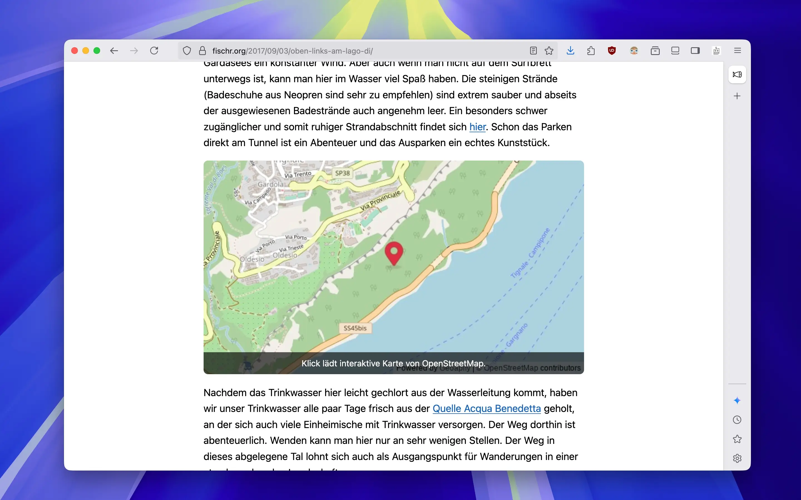

# Embed interactive maps powered by OpenStreetMap easily and privacy-friendly to your Micro.blog posts.


This plugin provides a privacy-friendly shortcode for embedding interactive maps into Micro.blog posts. It uses Leaflet together with OpenStreetMap, and Geoapify to generate static preview images of the embedded map. After clicking the static preview, the interactive OSM map is loaded. An optional privacy notice overlay can be shown on the static preview image.

## Usage

Add the following shortcode to a blog post to embed a map:

```markdown

```

```markdown

```

```markdown

```

The `loc` parameter accepts either coordinates (e.g. `48.1351,11.5820`) or address strings (e.g. `Marienplatz, München`). If the `zoom` parameter is not set, the default zoom level defined in the plugin settings will be used. Address lookups are performed via [Nominatim](https://nominatim.openstreetmap.org/). Optionally, provide a `marker` value to show a popup when the marker is clicked.

### Choosing a zoom level

Leaflet interprets zoom levels from 0 (whole world) up to 19 (street/building level). Values outside this range are clamped to the nearest supported level before both the static preview and the interactive map are rendered.

- City or region views usually work well between levels 10–13.
- Neighbourhood or town centres are often clearest around 14–16 (the plugin’s default is 14 if nothing else is configured).
- For very small areas—such as a single building—use 17–19.

The zoom setting in the shortcode overrides the default value defined in the plugin settings for that specific embed.

### Preview of the embed



You can see the plugin in action here: [Example Post](https://fischr.org/2017/09/03/oben-links-am-lago-di/)

### Try your settings in a browser

The repository ships with a standalone simulator in [`map-simulator/index.html`](map-simulator/index.html). Open the file in a
browser (or host it via GitHub Pages) and enter the same `loc`, `zoom`, `marker` and preview-style values that you would pass to
the shortcode. The page renders the static preview and lets you load the interactive map so you can verify the final embed
before publishing.

## Configuration

You can configure the following options via your Micro.blog plugin settings:

- Show or hide the overlay message.
- Customize the privacy notice text displayed on the overlay.
- Set the default zoom level (used if no zoom value is set in the shortcode).
- Provide optional static preview styles (Geoapify themes) for light and dark mode.
- Provide the Geoapify API key that is required for static previews.

Static previews are now powered exclusively by [Geoapify](https://www.geoapify.com/). Choose your preferred map theme and enter a valid Geoapify API key so the preview image loads correctly.

The general “Geoapify preview style” setting serves as the fallback for both light and dark previews. You can optionally provide separate style identifiers for light and dark mode; the plugin automatically selects the matching style when the visitor’s color scheme changes and falls back to the general style whenever a mode-specific value is missing.

### Migrating from Google Maps to OpenStreetMap

Version 4 introduces a new privacy-friendly architecture that replaces Google Maps with OpenStreetMap tiles served via Leaflet. If you are upgrading from an older release:

1. Visit the [Geoapify page](https://www.geoapify.com/) and create a free account. The Free plan currently includes **3000 map tile requests and 3000 static map
   requests per day**, which is more than enough for most Micro.blog sites.
2. After signing up, navigate to your Geoapify dashboard and create an API key.
3. Copy the generated key into the plugin settings field labelled “Geoapify API key”. Static previews will not load without a valid key.
4. Optionally choose one of Geoapify’s static map themes and enter its identifier in the
   “Static preview style” field (leave blank to keep the default style). Refer to the
   [Geoapify map style catalog](https://apidocs.geoapify.com/docs/icon/learn-more/) for the currently supported identifiers such as
   `osm-carto`, `klokantech-basic`, `maptiler-3d`, or `dark-matter-yellow-roads`.

> [!NOTE]
> Your existing posts and shortcodes do not need to change—the plugin will automatically use the new OpenStreetMap-based renderer once the Geoapify key has been added.

## Notes

Because the plugin talks directly to OpenStreetMap and Nominatim servers, please make sure your usage adheres to their respective terms of use. Heavy-traffic sites should consider running their own tile and geocoding services. To stay within the Nominatim usage policy, the plugin now caches address lookups for 14 days in the visitor's browser.

## 👤 Author

René Fischer – [https://fischr.org](https://fischr.org)

## Changelog

### 4.1.0
- Add optional Geoapify preview styles that automatically switch between light and dark mode based on the active site color scheme.

### 4.0.2
- Load the interactive map when the static preview is clicked anywhere, removing the dedicated button, and restore the marker visibility once the map is active.

### 4.0.1
- Allow customizing the load button text via the plugin settings and position it below the preview pin.

### 4.0.0
- Completely rewrote the plugin to move away from Google Maps and use OpenStreetMap + Geoapify instead.
